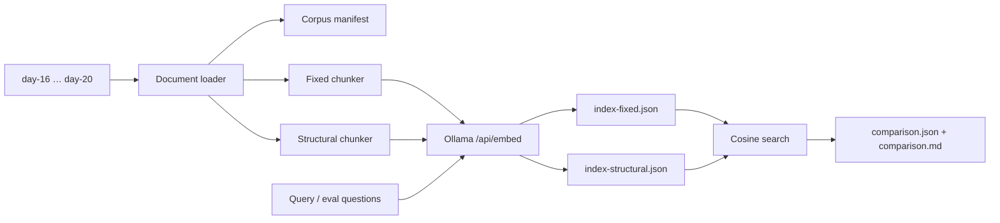

# Day 21 — Индексация документов

Воспроизводимый локальный RAG retrieval pipeline без генеративного чата:

```text
документы → извлечение текста → chunking → Ollama embeddings
           → атомарный JSON-индекс → cosine search → offline evaluation
```

Проект является самостоятельным Go-модулем. Он читает содержательные `.md`,
`.txt`, `.go` и `.pdf`, строит два индекса на одном корпусе и сравнивает
стратегии на фиксированном наборе вопросов. Embeddings никогда не
подменяются хэшами или случайными числами: production CLI работает только с
настоящим `/api/embed` Ollama.

## Архитектура



Пакеты разделяют ответственность:

- `internal/document` — фильтрация путей, извлечение текста и corpus manifest;
- `internal/chunk` — fixed и format-aware structural chunking;
- `internal/embedding` — интерфейс embedder, Ollama HTTP-клиент, batching и L2-нормализация;
- `internal/indexstore` — построение, строгая валидация и атомарная запись JSON;
- `internal/search` — cosine similarity и детерминированный top-k;
- `internal/evaluation` — Hit@1, Hit@5, MRR@5, примеры и отчёты;
- `cmd/rag` — единая точка входа для `corpus`, `index`, `search`, `compare`.

## Корпус

По умолчанию загружаются `day-16`–`day-20`. Фактический manifest содержит 106
документов, 485 464 Unicode-символа, 49 738 слов и 13 075 строк, то есть
**124.345 условной страницы** по формуле `total_words / 400`. Авторитетные
значения после каждого запуска находятся в `artifacts/corpus-manifest.json`;
CLI считает слова через Unicode-aware `strings.Fields`, поэтому результат может
немного отличаться от системной `wc`.

Для каждого документа manifest содержит относительный `source`, имя, тип,
число Unicode-символов, слов, строк либо PDF-страниц и SHA-256 исходных байтов.
Идентификатор корпуса — SHA-256 упорядоченных пар `source + content hash`.

Рекурсивный обход исключает `.git`, `vendor`, `node_modules`, `.env*`,
`artifacts`, каталоги сборки, generated-каталоги и `*_generated.go`. Видео,
изображения, архивы и прочие бинарные форматы не входят в allowlist.

PDF обрабатывается настоящим `pdftotext` из Poppler:

```bash
brew install poppler       # macOS
# sudo apt install poppler-utils   # Debian/Ubuntu
```

Если PDF встретился, а `pdftotext` отсутствует, загрузчик возвращает понятную
ошибку с командой установки. В текущем корпусе PDF нет, поэтому эта внешняя
зависимость для базового сценария не нужна.

## Подготовка Ollama

Установите и запустите [Ollama](https://ollama.com), затем загрузите модель:

```bash
ollama pull qwen3-embedding:0.6b
ollama list
curl http://127.0.0.1:11434/api/tags
```

Endpoint, модель, timeout и batch size задаются как флагами, так и окружением:

```bash
export OLLAMA_ENDPOINT=http://127.0.0.1:11434/api/embed
export OLLAMA_MODEL=qwen3-embedding:0.6b
export OLLAMA_TIMEOUT=2m
export OLLAMA_BATCH_SIZE=16
```

Флаги `--endpoint`, `--model`, `--timeout`, `--batch-size` имеют приоритет.
Клиент всегда отправляет `truncate: false`, проверяет число ответов, единую
размерность и конечность значений. Ollama обычно возвращает единичные векторы;
код проверяет L2-норму и безопасно нормализует только при необходимости.

## Команды

Из каталога `day-21`:

```bash
go run ./cmd/rag corpus \
  --input ../day-16,../day-17,../day-18,../day-19,../day-20 \
  --out artifacts/corpus-manifest.json

go run ./cmd/rag index \
  --input ../day-16,../day-17,../day-18,../day-19,../day-20 \
  --strategy all --target-words 700 --overlap 100 --out artifacts

go run ./cmd/rag search \
  --index artifacts/index-fixed.json \
  --query "Как агент маршрутизирует вызовы MCP?" --top-k 5

go run ./cmd/rag search \
  --index artifacts/index-structural.json \
  --query "Как агент маршрутизирует вызовы MCP?" --top-k 5

go run ./cmd/rag compare \
  --fixed artifacts/index-fixed.json \
  --structural artifacts/index-structural.json \
  --eval eval/questions.json --out artifacts --top-k 5
```

Короткие цели:

```bash
make corpus
make index
make search QUERY="Как агент маршрутизирует вызовы MCP?"
make compare
make test
```

`search` и `compare` извлекают имя модели из индекса. Явный `--model` допустим
только при точном совпадении: документ и запрос нельзя кодировать разными
моделями.

## Две стратегии chunking

`fixed` независимо обрабатывает каждый файл, берёт 700 слов с overlap 100 и
никогда не смотрит на заголовки. Шаг равен 600 словам; последний короткий чанк
сохраняется. Границы представлены смещениями Unicode code points, поэтому UTF-8
не разрезается.

`structural` использует формат документа:

- Markdown — ATX-заголовки `#`–`######` и полный путь заголовков;
- Go — `go/parser`/AST, package и верхнеуровневые `type`, `const`, `var`,
  `func`, method;
- TXT — абзацы, разделённые пустыми строками;
- PDF — страницы после `pdftotext`, секции `Page N`.

Логические разделы и файлы не смешиваются. Раздел больше лимита делится тем же
окном 700/100, а короткий раздел сохраняется отдельно.

## Chunk metadata и JSON-индекс

Каждый элемент `chunks` имеет вид:

```json
{
  "chunk_id": "structural-…",
  "source": "day-20/internal/mcpclient/client.go",
  "title": "client.go",
  "section": "method (*Client).CallTool",
  "strategy": "structural",
  "ordinal": 7,
  "start": 4200,
  "end": 5980,
  "word_count": 236,
  "text": "…",
  "embedding": [0.01, -0.02]
}
```

`chunk_id` стабилен и строится из strategy, source, section, ordinal и SHA-256
текста. Перед записью проверяются обязательные поля и отсутствие дубликатов.
Корень индекса содержит `schema_version`, стратегию, параметры chunking, модель,
размерность, UTC-время, corpus ID, статистику и chunks. Запись идёт во временный
файл с `fsync`, затем через atomic rename. Загрузка повторно валидирует схему,
стратегию, ID, размерность и непустые embeddings.

## Semantic search

Запрос кодируется той же моделью. Для каждого чанка считается cosine
similarity. Нормализованные векторы позволяют эквивалентно использовать dot
product, но реализация всё равно делит скалярное произведение на обе нормы и
проверяет нулевые векторы. Сортировка: score по убыванию, затем `chunk_id` по
возрастанию для воспроизводимых tie-breaks. Вывод содержит rank, score, source,
section, chunk ID и сокращённый фрагмент.

## Методика сравнения

`eval/questions.json` содержит 12 содержательных русскоязычных вопросов,
ожидаемые source, необязательные ожидаемые sections и объяснение релевантности.
Обе стратегии используют один corpus ID, одну модель и одинаковый top-k.
Релевантность метрик определяется по source — это общий ground truth, поскольку
fixed по определению не имеет структурных sections. Section остаётся полезной
аннотацией для разбора structural-выдачи.

- Hit@1 — доля вопросов с ожидаемым source на первом месте;
- Hit@5 — доля вопросов с ожидаемым source в первой пятёрке;
- MRR@5 — среднее обратного ранга первого релевантного результата;
- дополнительно: количество и min/avg/max слов чанков, время построения, размер
  JSON и средний top-1 similarity.

Фактический отчёт реального запуска сохранён в `artifacts/comparison.md` и
`artifacts/comparison.json`. Оба индекса построены моделью
`qwen3-embedding:0.6b`, имеют размерность 1024 и одинаковый corpus ID.

| Strategy | Hit@1 | Hit@5 | MRR@5 | Chunks | Words min/avg/max | Build | JSON | Avg top-1 |
|---|---:|---:|---:|---:|---:|---:|---:|---:|
| fixed | 0.250 | 1.000 | 0.540 | 136 | 10 / 387.8 / 700 | 64.713 s | 3,605,360 B | 0.5769 |
| structural | 0.417 | 0.833 | 0.611 | 1,025 | 2 / 48.7 / 700 | 67.966 s | 23,407,999 B | 0.6612 |

Structural в этом наборе чаще ставит релевантный источник первым и имеет более
высокий MRR@5 и average top-1 similarity. Fixed, однако, достиг Hit@5 = 1.000,
создал в 7.5 раза меньше чанков и примерно в 6.5 раза меньший файл. Поэтому
выбор зависит от приоритета: точность раннего ранжирования либо полнота top-5 и
стоимость хранения/поиска.

## Проверки

```bash
gofmt -w .
go test ./...
go vet ./...
```

Тесты не требуют Ollama. Они покрывают allowlist/denylist загрузчика и PDF
adapter, fixed overlap, Markdown/Go structure, стабильные ID и метаданные,
пустые чанки и файловые границы, mock HTTP-запрос Ollama с batch и
`truncate:false`, несовпадающие dimensions, нормализацию, JSON round trip,
cosine, tie-break сортировки, end-to-end pipeline с fake embedder и расчёт
Hit@k/MRR.

## Ограничения и развитие

- JSON прост и переносим, но загружается целиком и не подходит для миллионов
  чанков. Следующий шаг — SQLite с векторным расширением или FAISS.
- Полная переиндексация повторно кодирует неизменившиеся тексты. Можно добавить
  incremental cache по `source SHA-256 + chunking config + model`.
- Dense retrieval можно объединить с BM25 и затем применять cross-encoder
  reranking.
- PDF layout extraction не выполняет OCR. Для сканов потребуется Tesseract и
  явная маркировка OCR-текста.
- Метрики зависят от размера и разметки evaluation set; 12 вопросов —
  воспроизводимый smoke benchmark, а не статистически полный датасет.
