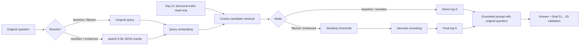

# Day 23 — reranking, фильтрация и query rewrite

Самостоятельный Go 1.26-модуль добавляет к RAG из Day 22 второй retrieval stage и сравнивает четыре режима на одном наборе из 10 вопросов:

- `baseline`: исходный вопрос, cosine top-5, без rewrite, threshold и reranking;
- `filtered`: исходный вопрос, top-20 кандидатов, threshold, heuristic reranking, final top-5;
- `rewritten`: один LLM rewrite, cosine top-5, без threshold и reranking;
- `enhanced`: rewrite, top-20, threshold, reranking, final top-5;
- `all`: все четыре режима; один rewrite переиспользуется между `rewritten` и `enhanced`.

Day 23 не собирает корпус, не режет документы, не строит embeddings index и не дублирует базовый RAG. Код Day 22 механически перенесён в новый модуль и расширен. Готовый structural index Day 21 открывается только для чтения по пути `../day-21/artifacts/index-structural.json`: schema 1, corpus `b7d4f83675e1fc7c8d1c112bee933610e15ecd5aa5ade9e6d30a7bbc070cc451`, `qwen3-embedding:0.6b`, dimension 1024, 1025 chunks.

## Pipeline



Rewrite влияет только на поиск и reranking. В grounded prompt всегда остаётся исходный вопрос. Интерфейс `Rewriter` позволяет тестировать это без Ollama. Реальная реализация вызывает локальный `/api/chat`, temperature 0, max 96 tokens и требует единственный JSON `{"query":"..."}`. Malformed/empty JSON, model error или timeout явно записываются в `rewrite.error`; поиск продолжает исходный вопрос с `fallback=true`. Совпавший с исходным текст — валидный rewrite с `applied=false`, а не ошибка.

## Threshold и reranking

Сначала cosine retrieval возвращает `candidate-K`. Кандидаты с `cosine < min-similarity` удаляются без скрытого возврата. Для остальных считаются:

```text
normalized_cosine = (cosine + 1) / 2
lexical_overlap   = |unique query tokens ∩ chunk text tokens| / |query tokens|
metadata_overlap  = |unique query tokens ∩ source/section tokens| / |query tokens|
rerank_score      = (alpha*cosine_norm + beta*lexical + gamma*metadata)
                    / (alpha + beta + gamma)
```

Токенизация Unicode-aware: принимает русские/английские буквы и цифры, приводит к lowercase, исключает слова короче трёх символов и небольшой список служебных слов. Default weights: `alpha=0.70`, `beta=0.20`, `gamma=0.10`. Сортировка идёт по score убыванию, tie-break — `chunk_id` по возрастанию. После неё берётся final top-5 и заново назначаются `[S1]…[S5]`; citation validator знает только этот финальный список.

Каждый JSON-кандидат содержит cosine, normalized cosine, lexical/metadata score, rerank score, threshold status, rank до/после и причину исключения. Если threshold удалил всё, `insufficient_context=true`, генератор не вызывается и возвращается явное сообщение о нехватке данных.

## Почему threshold 0.45

Команда `sweep` один раз строит реальные query embeddings и без answer generation проверяет `0.30…0.60`. Правило было задано заранее: среди thresholds, сохраняющих не меньше 95% максимального recall, выбрать лучший MRR; затем precision, меньший empty-context rate и более высокий threshold.

| Threshold | Recall | Precision | Hit@1 | MRR | Avg final chunks | Threshold rejected | Empty |
|---:|---:|---:|---:|---:|---:|---:|---:|
| 0.30 | 0.458 | 0.340 | 0.700 | 0.820 | 5.00 | 0.000 | 0.000 |
| 0.35 | 0.458 | 0.340 | 0.700 | 0.820 | 5.00 | 0.005 | 0.000 |
| 0.40 | 0.458 | 0.340 | 0.700 | 0.820 | 5.00 | 0.060 | 0.000 |
| **0.45** | **0.458** | **0.370** | **0.700** | **0.820** | **4.70** | **0.160** | **0.000** |
| 0.50 | 0.408 | 0.413 | 0.700 | 0.800 | 4.40 | 0.445 | 0.000 |
| 0.55 | 0.392 | 0.480 | 0.700 | 0.750 | 3.30 | 0.630 | 0.000 |
| 0.60 | 0.325 | 0.480 | 0.600 | 0.650 | 2.00 | 0.870 | 0.200 |

Полные данные: [`artifacts/threshold-sweep.json`](artifacts/threshold-sweep.json) и [`artifacts/threshold-sweep.md`](artifacts/threshold-sweep.md).

## Запуск

Нужны запущенная Ollama и локальные `qwen3-embedding:0.6b` и `qwen2.5:3b`:

```bash
ollama list

go run ./cmd/rag-agent ask --mode baseline \
  --question "Как агент маршрутизирует вызовы MCP?"

go run ./cmd/rag-agent ask --mode enhanced \
  --question "Как агент маршрутизирует вызовы MCP?" \
  --candidate-k 20 --final-k 5 --min-similarity 0.45 --json

go run ./cmd/rag-agent sweep
go run ./cmd/rag-agent eval
```

Флаги имеют приоритет над `.env.example`. Настраиваются index и оба endpoint/model, rewrite model/limit, timeout, temperature, max tokens, candidate/final K, threshold, три веса, evaluation dataset и output directory. CLI отклоняет неположительные K, `final-K > candidate-K`, threshold вне `[0,1]`, отрицательные/нулевые в сумме веса и несовместимые index model/dimension.

Makefile содержит `ask-baseline`, `ask-filtered`, `ask-enhanced`, `sweep`, `eval`, `test`, `vet`.

## Реальное сравнение

Финальный единый запуск 4 октября 2026 года использовал неизменённый `eval/questions.json`, SHA-256 `013e72b5fe3ce770b526ee47e63ec7d17b07aca3e2bcdd89e9ea25f42c2ddbe7`, structural index, `qwen2.5:3b`, temperature 0, max 512 tokens. Ошибок вызовов — 0, rewrite fallbacks — 0.

| Mode | Concept coverage | All concepts | Candidate recall | Final recall | Precision | Hit@1 | MRR | Cited recall | Invalid citations |
|---|---:|---:|---:|---:|---:|---:|---:|---:|---:|
| baseline | **0.392** | **0.100** | 0.442 | 0.442 | 0.340 | 0.500 | 0.700 | 0.333 | 0 |
| filtered | 0.350 | 0.000 | **0.758** | **0.458** | **0.370** | **0.700** | **0.820** | 0.242 | 0 |
| rewritten | 0.283 | **0.100** | 0.442 | 0.442 | 0.320 | 0.500 | 0.667 | **0.392** | 0 |
| enhanced | 0.183 | 0.000 | 0.750 | 0.425 | 0.360 | 0.400 | 0.567 | 0.200 | 12 |

| Mode | Rewrite ms | Retrieval ms | Rerank ms | Generation ms | Total ms | Prompt / completion tokens | Context runes |
|---|---:|---:|---:|---:|---:|---:|---:|
| baseline | 0.0 | 69.7 | 0.0 | 8131.5 | 8201.9 | 2098.1 / 217.6 | 3939.4 |
| filtered | 0.0 | 30.7 | 0.2 | 17647.0 | 17679.2 | 3134.0 / 560.3 | 8670.5 |
| rewritten | 725.8 | 53.7 | 0.0 | 6937.0 | 7717.1 | 1946.6 / 180.3 | 5079.7 |
| enhanced | 725.8 | 30.7 | 0.2 | 17232.0 | 17989.7 | 3075.0 / 510.1 | 8425.2 |

Результат не подтверждает, что полный `enhanced` автоматически лучше baseline. Прозрачный `filtered` pipeline улучшил retrieval: final recall `0.442 → 0.458`, precision `0.340 → 0.370`, Hit@1 `0.500 → 0.700`, MRR `0.700 → 0.820`; средний rank первого expected source улучшился на 0.60 позиции. Но более длинные выбранные chunks увеличили prompt и generation latency, поэтому answer coverage слегка снизился до 0.350.

Query rewrite оказался главным источником деградации. Например, русский `q08` превратился в короткий английский `web application session cookie chat history button new dialog`, теряя важные ограничения. В `q04-github-http-safety` enhanced всё же помог answer coverage `0.250 → 0.500`, а filtered достиг 0.750. В `q06-pipeline-integrity` enhanced ухудшил `0.500 → 0.000`. Для `q07-artifact-sandbox` expected-source recall вырос `0.333 → 0.667`, но concept coverage остался 0: retrieval-метрики сами по себе не гарантируют хороший ответ. 12 invalid citations enhanced также показывают, что длинный/неудачный контекст осложнил соблюдение citation contract даже после одной корректирующей попытки.

`Rank Δ` считается для первого expected source, присутствующего и до, и после reranking; положительное значение означает подъём к началу списка. `Threshold rejected` считает только chunks ниже порога, а кандидаты, прошедшие threshold, но не вошедшие в final-K, всё равно остаются в `rejected_candidates` с отдельной причиной.

Полный машинный результат и три подробных разбора: [`artifacts/evaluation.json`](artifacts/evaluation.json) и [`artifacts/comparison.md`](artifacts/comparison.md).

## Проверки

```bash
gofmt -w .
go test ./...
go vet ./...
```

Тесты не используют Ollama. Они покрывают реальную загрузку неизменённого structural index Day 21, baseline-совместимость с cosine top-k Day 22, K/threshold boundaries, empty context без fallback, Unicode scores, stable tie-break, отсутствие мутации index data, rewrite success/malformed/empty/model-error fallback, изоляцию expected data, embedding rewritten query, генерацию по original question, переиспользование rewrite, перенумерацию и validation citations по финальному контексту, JSON-поля, evaluation metrics и end-to-end pipeline на fakes.

## Ограничения и продолжение

- Evaluation из 10 вопросов мал и одновременно используется для threshold calibration и итоговой оценки; это smoke benchmark, а не независимый test set.
- Lexical overlap знает токены, но не морфологию, синонимы и отрицания; metadata score может поднять описательный README выше реализации.
- `qwen2.5:3b` недостаточно надёжен как rewriter и citation follower для длинного контекста.
- JSON-index загружается целиком, cosine search остаётся brute-force O(n).
- Concept substring coverage и source labels не доказывают entailment ответа.

Следующий практический шаг — отдельный cross-encoder reranker, hybrid BM25+dense retrieval, morphology-aware lexical score, context compression, claim-to-citation verification и calibration/holdout split большего датасета.
