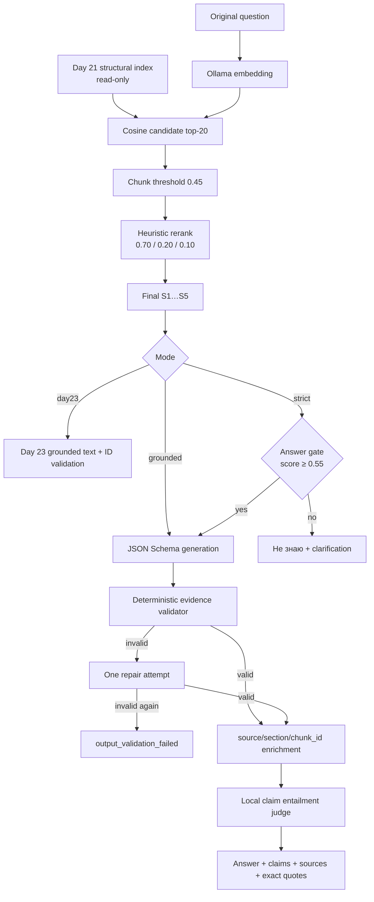

# Day 24 — цитаты, источники и анти-галлюцинации

Самостоятельный Go-модуль превращает Day 23 `filtered` RAG в проверяемую цепочку:

```text
answer → claim → final-context source ID → source/section/chunk_id → exact quote
                                                        ↓
                                               entailment proxy
```

Default-режим `strict` отказывается отвечать до генерации при слабом контексте,
а после генерации принимает только структурированный ответ с точными цитатами.
Невалидный ответ получает одну repair-попытку; повторная ошибка никогда не
становится grounded answer.

## Что переиспользовано

Day 24 механически перенёс и расширил совместимые части Day 23: строгий loader
индекса, Ollama embed/chat clients, cosine retrieval, Unicode lexical/metadata
scores, heuristic reranking, query rewriter и evaluation concepts/source
metrics. Импорты указывают на самостоятельный модуль `ai-challenge/day-24`;
прямых импортов `day-23/internal` нет.

Корпус, document loaders, PDF extraction, chunking и embeddings не строятся
заново. Модуль только читает готовый
`../day-21/artifacts/index-structural.json`: schema `1`, corpus
`b7d4f83675e1fc7c8d1c112bee933610e15ecd5aa5ade9e6d30a7bbc070cc451`,
model `qwen3-embedding:0.6b`, dimension 1024, 1025 structural chunks.

Retrieval по умолчанию буквально повторяет лучший Day 23 `filtered` вариант:
original query → candidate top-20 → cosine threshold 0.45 → rerank weights
0.70/0.20/0.10 → final top-5. Rewrite сохранён флагом `--rewrite`, но выключен:
эксперимент Day 23 показал ухудшение answer quality на `qwen2.5:3b`.

## Архитектура



`ask --mode all` делает embedding/retrieval/reranking один раз и запускает три
answer policy над одним final context.

## Режимы

- `day23` — контроль: тот же filtered retrieval и обычный ответ с `[S1]`;
- `grounded` — JSON Schema, exact-quote validation, repair и judge без answer gate;
- `strict` — `grounded` плюс pre-generation relevance gate; это default;
- `all` — все три режима с общим retrieval result.

## Structured response contract

Wire-формат намеренно устраняет два конфликтующих источника истины. Evidence
вложен прямо в claim:

```json
{
  "status": "answered",
  "answer": "Короткое утверждение [S1].",
  "claims": [
    {
      "id": "C1",
      "text": "Короткое утверждение",
      "evidence": [
        {"source_id": "S1", "quote": "дословная подстрока final chunk"}
      ]
    }
  ],
  "clarification_question": ""
}
```

Из этой единственной связи приложение строит канонические `claim.source_ids` и
общий список citations. Модель возвращает только `S<n>`; `source`, `section` и
`chunk_id` всегда подставляются из проверенного final context. JSON Schema
ограничивает ответ одним компактным claim и одной-двумя цитатами, чтобы
`qwen2.5:3b` не обрывал JSON при копировании целой функции.

Перед генерацией приложение показывает модели короткие quote-кандидаты. Каждый
кандидат детерминированно извлечён как реальная подстрока final chunk; модель
сама выбирает доказательство. Это не post-hoc исправление: возвращённые
`source_id` и `quote` всё равно проходят полный validator.

Для отказа приложение возвращает:

```json
{
  "status": "insufficient_context",
  "final_answer": "Не знаю: в базе недостаточно релевантных данных для надёжного ответа.",
  "claims": [],
  "citations": [],
  "clarification_question": "Уточните, к какому проекту, файлу или компоненту относится вопрос."
}
```

## Детерминированная валидация

`internal/evidence.Validator` проверяет непустые answer/claims, уникальные claim
IDs, final-context source IDs, присутствие claim text в answer, существование
evidence для каждого claim/source, известные claim IDs, inline citations,
детерминированный порядок и отсутствие duplicate sources.

Quote обязана быть непрерывной Unicode-подстрокой именно связанного final chunk.
Default bounds — 20–160 Unicode-символов; они настраиваются. Парафраз, пустая,
слишком короткая/длинная цитата, цитата из другого final chunk или только из
candidate list отклоняются. Длинная цитата не обрезается автоматически.

После первой ошибки repair prompt получает конкретные validation codes. Если
вторая попытка снова невалидна, результат получает
`abstention_reason=output_validation_failed`, safe answer и обе попытки в JSON.

Причины различаются:

- `empty_context` — chunk threshold удалил всё;
- `low_relevance` — final context есть, но answer score ниже 0.55;
- `output_validation_failed` — две невалидные structured generation;
- `runtime_error` — model/transport error; status становится `error`.

## Semantic entailment judge

`internal/judging.Judge` получает только original question, один claim и его
validated exact quotes. Он не видит expected answer, concepts или sources.
Локальный `qwen2.5:3b` при temperature 0 возвращает JSON verdict:
`supported`, `partially_supported`, `unsupported` или `unverifiable`.
Malformed/error никогда не превращается в `supported`.

Это автоматический proxy, а не доказательство корректности: небольшая модель
оценивает ответы той же модели. Для production нужен независимый более сильный
judge и human review.

## Chunk threshold и answer threshold

Это разные решения:

- chunk threshold 0.45 удаляет отдельные retrieval candidates до reranking;
- answer threshold 0.55 решает, можно ли вообще вызвать answer model.

Gate score — максимальный cosine среди final chunks. Контекст достаточен только
если final context непуст и `score >= threshold`; граница включительна.

`calibrate-gate` заранее перебрал grid 0.45…0.80 с шагом 0.01 без answer
generation. Positive set — неизменённые 10 вопросов Day 23; negative set — 6
отдельных OOD-вопросов. Правило было зафиксировано до анализа: максимальный F1
при false-refusal ≤20%; tie-break — меньший unsafe-answer rate, затем более
высокий threshold.

Результат: 0.45…0.55 дали F1 1.000, false refusal 0 и negative abstention 1.000;
tie-break выбрал **0.55**. Важное ограничение: все 6 negatives уже дали empty
context после chunk threshold 0.45, поэтому calibration не доказывает
дополнительную пользу 0.55 сверх empty-context gate. Это нужно перепроверить на
более трудном OOD/near-domain holdout, не меняя текущий набор post hoc.

## Запуск

Нужны локальные модели:

```bash
ollama pull qwen3-embedding:0.6b
ollama pull qwen2.5:3b
```

Из `day-24`:

```bash
go run ./cmd/rag-agent ask --mode strict \
  --question "Как минимальный Go MCP-клиент получает tools с пагинацией?" --json

go run ./cmd/rag-agent ask --mode grounded --question "..."
go run ./cmd/rag-agent ask --mode day23 --question "..."
go run ./cmd/rag-agent ask --mode all --question "..."

go run ./cmd/rag-agent calibrate-gate
go run ./cmd/rag-agent eval
go run ./cmd/rag-agent eval-abstention
```

Make targets: `ask-day23`, `ask-grounded`, `ask-strict`, `calibrate-gate`,
`eval`, `eval-abstention`, `test`, `vet`.

Все параметры имеют flags/env equivalents: index, embed/chat endpoints and
models, judge/rewrite models, candidate/final K, оба thresholds, reranker
weights, quote bounds, timeout, temperature, generator/judge/rewrite token
limits, dataset paths и output directory. Полный список: `go run
./cmd/rag-agent <command> -h` и `.env.example`.

## Реальные результаты 4 октября 2026

Main dataset SHA-256:
`013e72b5fe3ce770b526ee47e63ec7d17b07aca3e2bcdd89e9ea25f42c2ddbe7`.
Модели: `qwen3-embedding:0.6b`, answer/judge `qwen2.5:3b`; temperature 0,
generation 512, judge 128 tokens. Ошибок transport/model: 0.

| Mode | Concept coverage | Answered / abstained | Candidate / final recall | Precision | Hit@1 | MRR | Avg total ms |
|---|---:|---:|---:|---:|---:|---:|---:|
| day23 | 0.333 | 10 / 0 | 0.758 / 0.458 | 0.370 | 0.700 | 0.820 | 12692.4 |
| grounded | 0.000 | 5 / 5 | 0.758 / 0.458 | 0.370 | 0.700 | 0.820 | 10248.0 |
| strict | 0.000 | 5 / 5 | 0.758 / 0.458 | 0.370 | 0.700 | 0.820 | 9970.2 |

| Mode | Answer+source | Metadata / valid IDs | Answer+quote | Claims+quote/evidence | Exact quote | Fully supported |
|---|---:|---:|---:|---:|---:|---:|
| day23 | 0.600 | 1.000 / 1.000 | 0.000 | 0.000 / 0.000 | 0.000 | 0.000 |
| grounded | 1.000 | 1.000 / 1.000 | 1.000 | 1.000 / 1.000 | 1.000 | 0.200 |
| strict | 1.000 | 1.000 / 1.000 | 1.000 | 1.000 / 1.000 | 1.000 | 0.200 |

Accepted grounded/strict claims: 1 `supported`, 0 partial, 0 unsupported, 4
`unverifiable`. Five in-domain answers were safely rejected after two validation
failures, hence false-refusal rate 0.500 in end-to-end evaluation even though
gate-only calibration false refusal was 0.

Abstention evaluation: 6 questions, abstention rate 1.000, unsafe answered rate
0.000, answer model skipped 6/6, all six reasons `empty_context`, average latency
48.7 ms. No negative reached the separate low-relevance branch in this dataset.

Полные raw outputs, contexts, attempts, metadata, quotes, verdicts, latency и
tokens находятся в `artifacts/evaluation.json`; readable comparison — в
`artifacts/comparison.md`. Gate и OOD отчёты сохранены отдельно.

## Успехи, провалы и следующие шаги

Успех: каждый принятый structured ответ имеет source metadata, source ID из
final context, claim→evidence связь и exact quote. OOD gate не вызвал answer
model ни разу.

Провал/trade-off: strict не победил по answer quality. Ограничение одним claim
сделало output устойчивее, но concept coverage принятых коротких ответов стало
0.000; пять ответов отклонены из-за malformed/contract failures. В `q02`
единственный fully-supported claim был точным, но слишком узким — «Первый запуск
назначается сразу» — и не ответил на весь вопрос. Exact quote доказывает
происхождение, но не полноту.

Дальше нужны: более сильная structured-output модель, context compression,
двухфазная генерация claim→quote, near-domain abstention holdout, independent
NLI/cross-encoder judge, multi-claim schema при большем token budget и human
review. Retrieval остаётся ограничением: expected final source recall всего
0.458.

## Проверки

```bash
gofmt -w .
go test -count=1 ./...
go vet ./...
```

Тесты покрывают неизменённый Day 21 index, совместимость Day 23 filtered
retrieval, S1…Sn renumbering, source enrichment, Unicode exact quotes, wrong
chunk/candidate-only/unknown IDs, quote bounds, malformed JSON, repair/refusal,
gate boundary, отсутствие generator call, reasons, judge fallback, prompt
isolation, metrics, JSON round trip, fake end-to-end и отсутствие мутации index.
