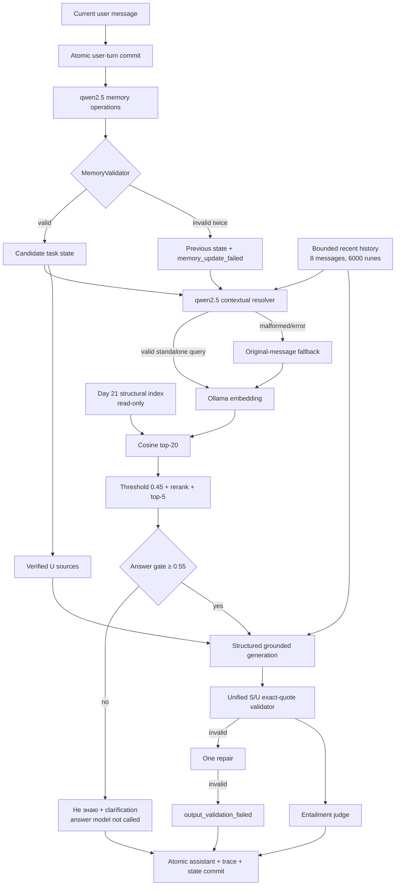

# Day 25 — mini-chat с RAG и проверяемой task memory

Самостоятельный Go-модуль добавляет production-like multi-turn слой поверх
строгого RAG Day 24:

```text
user message → durable user-turn commit → validated memory operations
             → contextual query resolver → Day 24 filtered retrieval
             → relevance gate → structured answer → exact quote validation
             → entailment judge → atomic assistant/state commit
```

Чат хранит полную историю на диске, но передаёт модели только ограниченное окно.
Отдельная task memory содержит исключительно явно зафиксированные пользователем
цели, ограничения, термины, решения, уточнения и открытые вопросы. Любой item
ссылается на существующий user turn и содержит дословную пользовательскую
цитату. Предыдущий ответ ассистента и RAG chunks не могут стать memory source.

## Локальный web-чат

Day 25 включает полноценное browser-приложение поверх того же
`chatservice.Service`, что и CLI. История не дублируется в памяти web-сервера:
страница всегда читает persistent `chatstore.FileStore`, а каждый новый turn
выполняется через `Service.Ask`.

### Prerequisites

- Go версии, совместимой с `go 1.26` в `go.mod`;
- локальный [Ollama](https://ollama.com/) на `127.0.0.1:11434`;
- готовый read-only индекс `../day-21/artifacts/index-structural.json`;
- модели `qwen3-embedding:0.6b` и `qwen2.5:3b`.

Подготовка и проверка моделей:

```bash
ollama serve
ollama pull qwen3-embedding:0.6b
ollama pull qwen2.5:3b
ollama list
```

В отдельном терминале из каталога `day-25`:

```bash
go run ./cmd/rag-web
# или
make web
```

Откройте <http://127.0.0.1:8080>. По умолчанию сервер слушает только loopback.
Адрес, store, index, timeout, endpoints и все пять model roles можно менять
flags или переменными из `.env.example`, например:

```bash
go run ./cmd/rag-web \
  --addr 127.0.0.1:8080 \
  --store-dir .sessions \
  --mode task-memory \
  --timeout 2m
```

Левая панель создаёт, выбирает и удаляет persistent-сессии. Центр показывает
полную сохранённую историю и честный pending-state обычного HTTP POST без
псевдо-streaming. Справа доступны:

- **Источники** — corpus `S*`, task-memory `U*`, metadata, exact quotes,
  claims и связи с citations;
- **Память** — active goal, constraints, terms, decisions, clarifications,
  open questions и superseded history;
- **Trace** — original/resolved query, resolver fallback, использованные turn и
  memory IDs, gate, validation и judge;
- **Метрики** — latency этапов, token usage, размеры контекста и статус commit.

Refresh страницы и restart процесса восстанавливают историю и task memory из
того же `--store-dir`. Cookie `day25_session` содержит только безопасный session
ID, имеет `HttpOnly`, `SameSite=Strict`, `Path=/` и ограниченный срок жизни.
Для HTTPS включите `--secure-cookie` или `RAG_WEB_SECURE_COOKIE=true`.

### HTTP API

```bash
curl -sS http://127.0.0.1:8080/healthz
curl -sS -c /tmp/day25.cookies -b /tmp/day25.cookies \
  http://127.0.0.1:8080/api/bootstrap

curl -sS -c /tmp/day25.cookies -b /tmp/day25.cookies \
  -H 'Content-Type: application/json' \
  -d '{"session_id":"project-audit"}' \
  http://127.0.0.1:8080/api/sessions

curl -sS -c /tmp/day25.cookies -b /tmp/day25.cookies \
  -H 'Content-Type: application/json' \
  -d '{"session_id":"project-audit","mode":"task-memory","message":"Наша цель — проверить безопасный commit."}' \
  http://127.0.0.1:8080/api/chat

curl -sS http://127.0.0.1:8080/api/sessions/project-audit
curl -sS -X DELETE http://127.0.0.1:8080/api/sessions/project-audit
```

Web API использует строгий JSON contract, body limit, единый безопасный error
format и не возвращает raw prompts, внутренние runtime errors или абсолютные
пути. Запросы одной сессии сериализуются отдельным lock; разные сессии не
блокируют друг друга. Web и CLI одновременно писать в один store не должны:
для multi-process режима понадобится межпроцессный lock или SQLite.

## Что переиспользовано

Day 25 механически перенёс совместимые пакеты Day 24 в собственный module path
`ai-challenge/day-25`: loader индекса, Ollama clients, cosine retrieval,
Unicode-aware filtering/reranking, optional Day 23 rewrite, structured
generation, JSON Schema, source enrichment, exact-quote validator, одну repair
попытку, semantic judge и evaluation helpers. Прямых импортов
`day-24/internal/...` нет.

Корпус, loaders, PDF extraction, chunking и embeddings не повторяются. Индекс
Day 21 читается по `../day-21/artifacts/index-structural.json` только для чтения:

- corpus ID `b7d4f83675e1fc7c8d1c112bee933610e15ecd5aa5ade9e6d30a7bbc070cc451`;
- embedding `qwen3-embedding:0.6b`, dimension 1024;
- candidate-K 20, final-K 5, chunk threshold 0.45;
- answer threshold 0.55;
- reranker 0.70 / 0.20 / 0.10;
- quotes 20–160 Unicode-символов;
- answer/judge/memory/resolver `qwen2.5:3b`, temperature 0;
- generation 512, judge 128 tokens;
- Day 23 query rewrite выключен.

Порог 0.55 был выбран retrieval-only calibration Day 24. Он не перестраивался
и не подгонялся под conversation scenarios Day 25.

## Архитектура



## Три режима

- `stateless` — каждый turn является независимым Day 24 `strict ask`; полная
  история всё равно сохраняется для аудита, но retrieval/generator её не видят.
- `history` — resolver и generator получают bounded recent history; отдельного
  task state нет.
- `task-memory` — bounded history, persistent validated state, resolver и
  user-memory sources. Это default, но не объявленный заранее победитель.

History помогает коротким follow-up только пока нужный turn остаётся в окне.
Task memory сохраняет старую цель и ограничения после выхода исходного turn из
окна, но добавляет два model call и собственные failure modes.

## Persistent session store

`internal/chatstore` хранит по одному JSON-файлу на session. ID допускает только
1–64 ASCII letters/digits/`_`/`-`; absolute path, `..`, `/` и `\` запрещены.
Store-dir приводится к absolute path, а итоговый path проверяется через
`filepath.Rel`.

Запись использует temporary file в том же каталоге, permissions `0600`,
`fsync`, atomic rename и `fsync` каталога. Версия увеличивается монотонно;
`Save(expectedVersion, session)` отклоняет stale writer. Mutex удерживается
только во время коротких файловых операций, но никогда во время Ollama calls.
`reset-session` удаляет ровно один безопасно разрешённый JSON-файл.

Turn имеет два commits. Сначала сохраняется user message, поэтому model/runtime
failure его не теряет. После полностью сформированного результата одним atomic
commit сохраняются assistant message, candidate state и полный trace. Version
conflict не перезаписывает новую session. Runtime sessions находятся в
`.sessions/`, которая исключена из Git; evaluation transcripts лежат в
`artifacts/`.

## Conversation и task-state schema

Основные типы определены явно в `internal/chat`:

```go
type Message struct {
    ID string; Turn int; Role Role; Content string; CreatedAt time.Time
}

type MemoryItem struct {
    ID string; Kind MemoryKind; Value string
    SourceTurnID string; UserQuote string; CreatedAt time.Time
    Supersedes string
}

type TaskState struct {
    Goal *MemoryItem
    Constraints, Terms, Decisions, Clarifications, OpenQuestions []MemoryItem
    History []MemoryItem // immutable superseded audit trail
}
```

Full history не обрезается на диске. Default limits: 8 recent turns, 6000
Unicode-runes prompt history, 64 active memory entries, 500 session messages и
12 000 runes на сообщение. Window сохраняет только целые UTF-8 messages.

## Memory update, provenance и conflicts

Локальная модель возвращает только `set_goal`, `add`, `supersede`,
`resolve_open_question` или `noop`. Для маленькой 3B-модели schema динамически
ограничивает допустимые operation/kind, current turn ID, exact quote и active
supersede IDs. Это не доверие к модели: `MemoryValidator` после генерации снова
проверяет строгий JSON, enum, user role, exact Unicode substring, существование
item, совпадение kind, duplicates и state limits.

После первой ошибки модель получает validation messages. Повторная ошибка
оставляет старый state без изменений, записывает оба raw output/error и
`memory_update_failed`, но user turn не теряется и RAG продолжает работу.

Merge policy детерминирован:

- новая цель заменяет старую только через явный `supersedes`;
- новое ограничение не удаляет существующие;
- «больше не учитывай X» создаёт новую актуальную версию и архивирует X;
- active state исключает superseded item, а `superseded_history` хранит его
  ID, quote и source turn навсегда;
- active lists сортируются по стабильному content-derived memory ID.

## Contextual query resolver

Resolver видит original current message, bounded history и active state, но не
expected answer/source/concepts evaluator-а. Он возвращает строгий JSON:

```json
{
  "search_query": "Artifact MCP защита от path traversal в Go",
  "used_turn_ids": ["U2", "U3"],
  "used_memory_ids": ["M113bb65a1672"]
}
```

Validator принимает только существующие user-turn IDs и active memory IDs;
assistant turn не может быть session-fact source. Empty/duplicate IDs
канонизируются, unknown/stale IDs, malformed JSON, model error и timeout дают
явный fallback на original message. Original message отдельно хранится и всегда
доступно answer generator. Это multi-turn context resolution, а не выключенный
Day 23 rewrite.

## Два класса источников

Corpus evidence сохраняет Day 24 IDs `S1…Sn` и metadata `source`, `section`,
`chunk_id`, cosine/rerank. Task-memory evidence получает response-local IDs
`U1…Un`, `kind=task_memory`, `source=conversation:<session>`, section user turn,
chunk `user-turn-U<n>` и exact `user_quote`.

Unified validator требует S у corpus claim, U у memory claim и оба вида у
mixed claim. Quote обязана находиться именно в связанном final chunk или
проверенном user message. Unknown/wrong-chunk IDs, quote другого user turn и
assistant source отклоняются. Metadata подставляет приложение. Memory-only
recap отвечает без corpus facts и без answer model; factual answer никогда не
обходит Day 24 gate из-за наличия памяти.

## CLI

Из `day-25`:

```bash
go run ./cmd/rag-chat chat \
  --session artifact-audit --mode task-memory

go run ./cmd/rag-chat ask \
  --session artifact-audit --mode task-memory \
  --message "Теперь проверь ограничение размера." --json

go run ./cmd/rag-chat show-session --session artifact-audit
go run ./cmd/rag-chat show-memory --session artifact-audit
go run ./cmd/rag-chat list-sessions
go run ./cmd/rag-chat reset-session --session artifact-audit
go run ./cmd/rag-chat eval-scenarios
```

Interactive commands: `/memory`, `/history`, `/sources`, `/state`, `/new`,
`/help`, `/exit`. Make targets: `chat`, `ask`, `show-session`, `show-memory`,
`reset-session`, `eval-scenarios`, `test`, `vet`.

## Реальная проверка 4 октября 2026

Фиксированный dataset содержит ровно 2 сценария на 11 и 12 user messages; SHA-256
`675eeebb79dbc1e323bf538410090ef71bf4cd28d97647be173d0ed77949e8c8`.
Все 69 runs выполнены реальными локальными моделями, не mocks. Ошибок transport
или evaluator — 0, state reload после процесса — 1.000 во всех режимах.

### Continuity и retrieval

| Mode | Goal | Constraints | Terms | Supersede | Follow-up query | Fallbacks | Candidate/final recall | Precision | MRR |
|---|---:|---:|---:|---:|---:|---:|---:|---:|---:|
| stateless | 0.000 | 0.000 | 0.000 | n/a | 0.077 | 0 | 0.500 / 0.000 | 0.000 | 0.000 |
| history | 0.000 | 0.000 | 0.000 | n/a | 0.154 | 0 | **0.750 / 0.625** | **0.125** | **0.313** |
| task-memory | **1.000** | **1.000** | **1.000** | **1.000** | **0.231** | 0 | 0.500 / 0.500 | 0.100 | 0.229 |

Query success — строгая проверка всех заранее заданных entities, поэтому число
ниже доли семантически полезных rewrite. Task-memory полностью сохранила цель,
constraints, clarification, terms и supersede; history улучшила retrieval, но
не имеет проверяемого persistent state.

### Ответы и grounding

| Mode | Answered / refused / memory-only | Answer+source | Metadata / valid ID | Answer+quote | Claim+evidence | Exact quote | Fully supported |
|---|---:|---:|---:|---:|---:|---:|---:|
| stateless | 5 / 18 / 0 | 1.000 | 1.000 / 1.000 | 1.000 | 1.000 | 1.000 | 0.800 |
| history | 13 / 10 / 0 | 1.000 | 1.000 / 1.000 | 1.000 | 1.000 | 1.000 | 0.077 |
| task-memory | 5 / 6 / 12 | 1.000 | 1.000 / 1.000 | 1.000 | 1.000 | 1.000 | 0.941 |

Entailment proxy: stateless 4 supported / 1 unverifiable; history 1 / 12;
task-memory 4 / 1. Corpus claims with S evidence = 1.000 во всех режимах,
memory claims with U evidence = 1.000 в task-memory, assistant text cited as
fact = 0. Mixed claims were not produced, поэтому mixed-rate остаётся 0, а не
ложно объявляется успешным. У history было 6 invalid quote attempts, но ни одна
невалидная попытка не стала принятым answer.

Высокий task-memory fully-supported rate включает 12 deterministic memory-only
recaps с exact user provenance и поэтому не сравним напрямую с corpus-only
полнотой. Как показал Day 24, exact quote подтверждает происхождение, но не
полноту ответа.

### Сценарии

| Scenario / mode | Answered | Refused | Memory-only |
|---|---:|---:|---:|
| Artifact audit / stateless | 2 | 9 | 0 |
| Artifact audit / history | 7 | 4 | 0 |
| Artifact audit / task-memory | 3 | 3 | 5 |
| MCP reliability / stateless | 3 | 9 | 0 |
| MCP reliability / history | 6 | 6 | 0 |
| MCP reliability / task-memory | 2 | 3 | 7 |

Показательные turns:

- MCP reliability turn 5: stateless отказался на «после перезапуска», а
  task-memory восстановила query `restart persistence scheduler Go` и дала
  validated U-source answer. Это корректно фиксирует пользовательское
  ограничение, но не corpus fact; маленькая модель выбрала узкий memory claim.
- Turn 10 после выхода цели из recent window вернул её из `Maa032798f8ba` с
  source `U1`, exact quote исходного user turn и без assistant source.
- Artifact turn 9 заменил Go-only constraint: старый `Mcb1f0dea8baf` остался в
  audit history, новый `M4843fc58324a` ссылается на него через `supersedes`.
- Artifact turn 4 resolver восстановил `Artifact MCP защита от path traversal в
  Go`, gate прошёл в smoke-run, но две невалидные structured generations дали
  безопасный `output_validation_failed`, а не неподтверждённый ответ.
- Реальный OOD smoke про неаполитанскую пиццу дал `insufficient_context`,
  «Не знаю» и не вызвал answer model.

### Latency и tokens

| Mode | Load/save | Memory | Resolver | Retrieval | Generation | Judge | Total, ms |
|---|---:|---:|---:|---:|---:|---:|---:|
| stateless | 3.9 / 38.8 | 0.0 | 0.0 | 50.8 | 1791.7 | 98.0 | **1965.8** |
| history | 4.0 / 43.9 | 0.0 | 1382.5 | 61.0 | 10767.6 | 292.2 | 12531.3 |
| task-memory | 2.7 / 34.0 | 2138.1 | 890.7 | 40.2 | 4895.4 | 99.0 | 8085.9 |

Total token usage:

| Mode | Memory prompt/completion | Resolver | Answer | Judge |
|---|---:|---:|---:|---:|
| stateless | 0 / 0 | 0 / 0 | 18 750 / 1 488 | 1 079 / 61 |
| history | 0 / 0 | 11 205 / 716 | 66 947 / 6 827 | 2 863 / 191 |
| task-memory | 8 031 / 1 626 | 7 469 / 646 | 34 303 / 3 342 | 1 023 / 61 |

History ответила чаще и показала лучший retrieval, но оказалась самой медленной
из-за длинных grounded generations. Task-memory выиграла continuity и
provenance, не retrieval quality. Stateless осталась самой дешёвой и имела
лучший fully-supported rate среди corpus-only принятых ответов. Поэтому общего
«победителя» эти данные не показывают.

## Проверки

```bash
gofmt -w .
go test -count=1 ./...
go vet ./...
```

Тесты покрывают safe IDs/path escape, isolation, atomic JSON permissions,
restart reload, monotonic version/conflict, failed save preservation, точечный
reset, deterministic order, Unicode history/message limits, JSON round trip;
memory kinds/provenance/duplicates/invalid op/kind/supersede/conflicts/audit
history/malformed+repair/state limits; resolver IDs/stale state/fallback/original
message/prompt isolation; unified S/U evidence, wrong user turn, unknown IDs и
mixed evidence; неизменённый Day 21 index, gate 0.55, safe no-generator refusal;
10-turn fake end-to-end с restart и supersede без мутации index.

## Ограничения и развитие

- `qwen2.5:3b` всё ещё нарушает structured contract; safe refusals снижают
  полноту. Более сильная structured-output модель уменьшила бы false refusals.
- Resolver полезен, но exact entity success 0.231 даже с памятью; нужен
  morphology-aware validation и более качественная contextualization model.
- Task memory распознаёт явные языковые маркеры и затем всё равно требует
  локальную модель + validator. Более свободные формулировки требуют отдельного
  intent classifier.
- Memory presence не обходит gate. Некоторые корректные user-only answers
  остаются узкими и не отвечают на фактическую часть вопроса.
- JSON store надёжен для одного процесса и умеренного объёма, но для
  multi-process production нужен advisory lock/SQLite transaction layer.
- Brute-force JSON index остаётся O(n); нужны hybrid retrieval, cross-encoder,
  context compression и независимый NLI judge.

Полные raw outputs, state before/after, resolver traces, candidates, sources,
quotes, verdicts, latency и tokens: `artifacts/scenario-evaluation.json`.
Читаемые отчёты: `artifacts/comparison.md`, оба transcript и
`artifacts/memory-timeline.md`.
